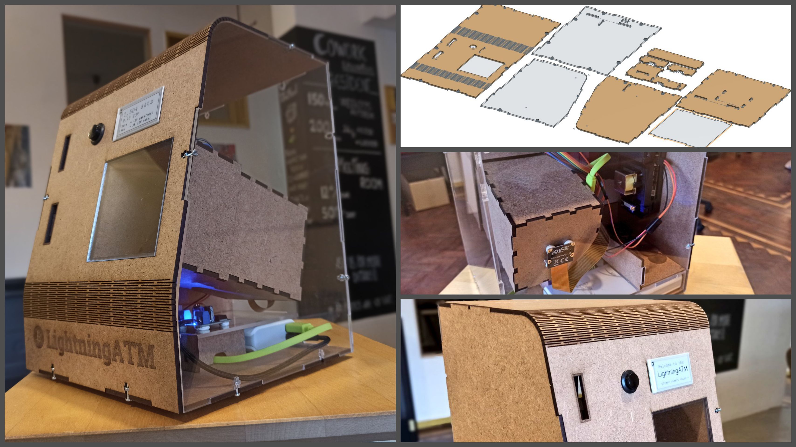

# This is the Bitcoin LightningATM

### 🔎 What you'll find here  :

* Hardware and software requirements in detail
* About 1.5 hours of video content to assemble all the hardware parts
* Written documentation for the software and wallet setup

> 👩💻 For the code head over to [https://github.com/21isenough/LightningATM](https://github.com/21isenough/LightningATM)

Feel free to join the "LightningATM" Telegram group for more information and help. Also a great way to communicate with other "ATM builders" and share knowledge and experience:


Join the Telegram group here: [https://t.me/lightningatm\_building](https://t.me/lightningatm_building)


