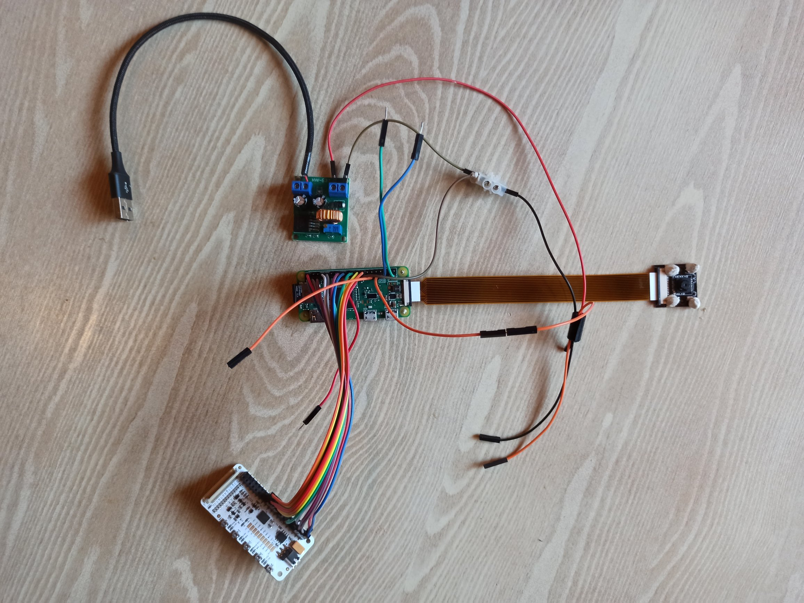
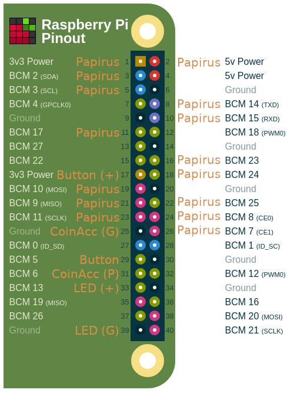

# Wiring Details

## Wiring Details

1. USB power cable to supply 5V power to the step up converter \(standard USB micro cable can be cut in half and the `USB type A` part used for this\).
2. USB micro cable to provide 5V power to the Raspberry Pi Zero \(second half of the cable cut in half in step 1\).
3. If you are using a step up transformer, that can supply a variable amount of voltage, make sure it is properly set to 12V with a multi meter \(by twisting and adjusting the tiny screw\).
4. The output of the step up transformer \(set to 12V\) supplies to coin acceptor with 12V power.
5. The ground connection of the step up transformer must also be connected to a ground pin of the Raspberry Pi Zero \(see pin out details below`CoinAcc(G)`).
6. Attach the camera to the CSI camera port of the Raspberry Pi.
7. To detect button presses, pins`BCM5`and`3v3 power`\(see pinout below\) need to be connected to the button \(normally closed connection \(NC\)\).
8. \(Optional\)`BCM13`and `Ground` \(see pinout below\) can be used, if your button has an LED inside, that can be controlled by the ATM software.
9. Cables that connect the Papirus E-Ink display to the Raspberry Pi Zero \(see pinout below\).

