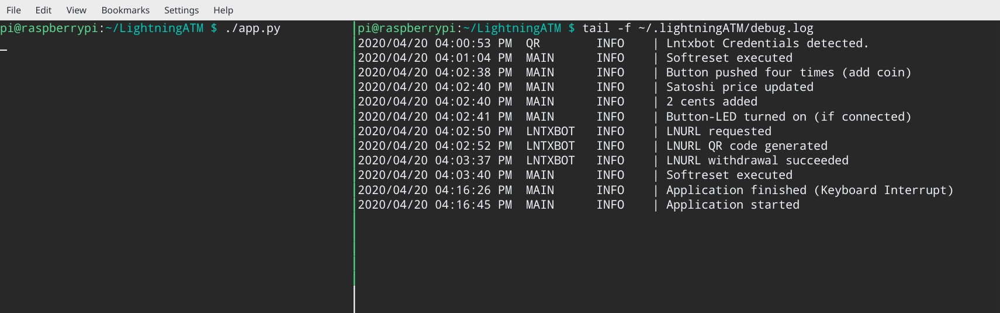

# Monitoring the log file

## 💻 Install tmux

In order to see what is going on the ATM and check the log file, we will first install `tmux`. Tmux is a terminal multiplexer for Unix-like operating systems and allows us to split our terminal screen in half \(among other things\). Install `tmux` with the following command on your ATM:

```text
sudo apt install tmux
```

## 👷 Using tmux

After it has finished installing you can start a new tmux session by typing `tmux` into the command line.

```text
tmux
```

Every action in `tmux` has to be "announced"  with the key combination `Ctrl + b`. Let's try this 🍪 ! First do `Ctrl + b` and then the percent sign `%` \(you might have to use the `Shift` key for this\). This should have split your terminal window vertically in half.

You can jump between the two sides with `Ctrl + b` and then `left arrow` or `right arrow`. You can adjust the size of the two windows by typing `Ctrl + b` and while keeping the `Ctrl` key pushed down , use the left/right arrow keys to adjust it to your liking \(press the arrow keys multiple times\).

You can detach from your current `tmux` session with `Ctrl + b` and the key `d`. If you want to get back into that same session type:

```text
tmux a
```

\(This only works, if you have just one `tmux` session\).

A pretty good cheat sheet for an advanced usage of tmux [can be found here](https://tmuxcheatsheet.com/).

## 🖥 Monitoring the ATMs log file

We will start following our debug log file in our right side of the session. The logfile has been created automatically as you started your ATM for the very first time here: `~/.lightningATM/debug.log`

Move to the right side of the terminal session with the cursor and then type:

```text
tail -f ~/.lightningATM/debug.log
```

You will get to see the last 10 entries in that log file and it will automatically update as soon as a new entry shows up in the log file \(The file might not exist yet, if you have a completely fresh installation. Just the start the ATM once with `./app.py` and then try again\).

Move back to the left side of your screen and there we start the ATM software with:

```text
cd ~/LightningATM
./app.py
```

As the ATM starts, you will now see an additional line appear on the right side saying `Application started`. Perfect, we can now monitor closely what is going on inside the ATM. It should now look something like this:




Join the Telegram group here: [https://t.me/lightningatm\_building](https://t.me/lightningatm_building)

