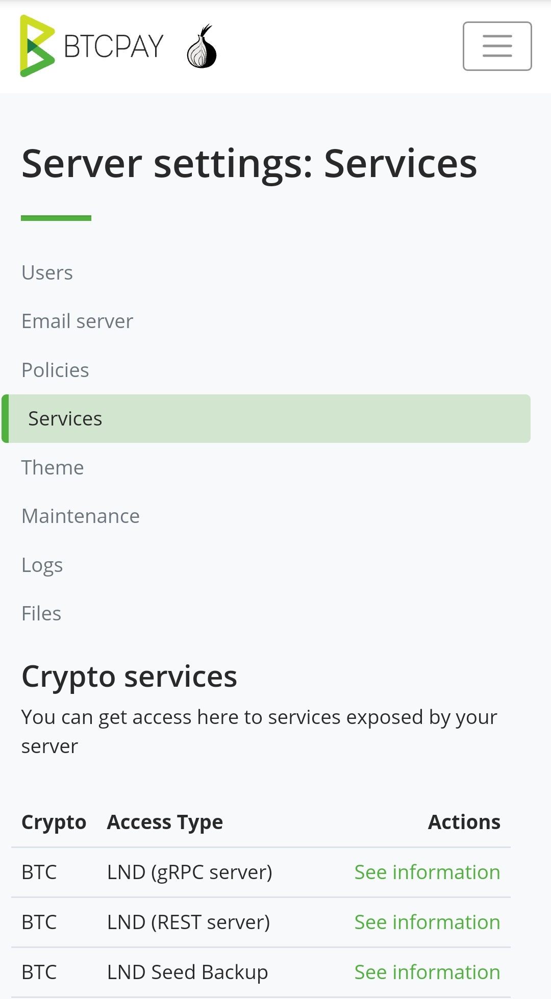
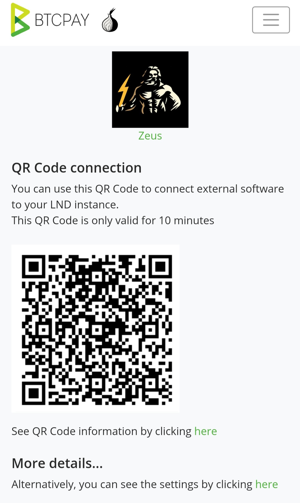


Make sure, you have finished the hardware video part 3, before you attempt to setup your wallet \([https://www.youtube.com/watch?v=A9JKUQvvmYM](https://www.youtube.com/watch?v=A9JKUQvvmYM)\)


# LND \(on BTCPayServer\)

## Updating your current installation

Before you continue, make sure you are on the latest version of the ATM software. For this we go into the `LightningATM` folder and execute one git command:

```text
cd ~/LightningATM
git pull
sudo pip3 install -r requirements.txt
```

You should now have the latest changes and therefore the latest version of the LightningATM software on your Raspberry Pi.

## For a little more advanced users

The coming steps will involve a pretty automated process and the ATM literally configures itself. If you feel like you could take up a little challenge then stop reading and set it up yourself with the following hints of mine. If not, just skip this step and move down to `Displaying your BTCPayServer QR code`.

* In your BTCPayServer go to `SERVER SETTTINGS` and then `Services`.
* Go down to the table and where it says `LND (REST server)` and click `See information`
* Go all the way down and where it says `More details...` click on "by clicking `here`"
* What we need here is `REST Uri` and the `Macaroon`

In order for the ATM to connect with your LND node on BTCPayServer, `REST Uri` and the `Macaroon` will now have to be inserted into the configuration file of the ATM. The configuration file of your AT can be found here: `~/.lightningATM/config.ini`

Let's inspect what is inside this wile with the editor `nano`. Type in the following to open the file with the `nano` editor:

```text
nano ~/.lightningATM/config.ini
```

Towards the end of the file you will find a section that's named `[btcpay]` and there is a variable `url`. Just below there is another section `[lnd]` with a variable `macaroon`.

You will now have to set those variables equal to the values that you've found in your BTCPayServer interface. Save the file, exit and restart your ATM. It's now configured with your LND node on your BTCPayServer!


## Displaying your BTCPayServer QR code

Log into your BTCPayServer where you have your LND node running. In the menu choose the item `SERVER SETTINGS` and then `Services`. That's what this will look like, on a mobile phone:



At the bottom in the table you can see the column `Access Type` and in there `LND (REST server)`. Next to `LND (REST server)` click on the link `See information`. Scroll down a little and find the green button that reads `Show QR Code` an click it.



This is all we need - have this QR ready for the next step. Be aware that this QR code is only valid for 10 minutes so you might need to refresh your browser and create a new one when you'll get an error at the ATM.

## Connecting to the ATM

We will now connect the LND node to your ATM. For this we access our ATM again through SSH, change into the `LightningATM` directory and start the software with:


```text
cd ~/LightningATM
./app.py
```

It's best to monitor the log file with `tmux`, while you are doing this. Check out how to do that here:


This will again start the ATM software and we get to see `Welcome to the LightningATM` on our screen.

We'll now have to put our ATM into the "credentials scanning" mode. This can be done by pushing the button 3 times.

After you pushed the button three times your display should say `Please scan your wallet credentials`. Now take your mobile phone with the LND BTCPayServer QR code and show it to the camera.

It will now scan your credentials, evaluate its content and safe it to the configuration file of the ATM. If you've been successful, your screen will say `Success!!` and your LND node is successfully linked with your ATM.

## First transaction with the ATM

Let's make a first proper transaction now!

Insert some coins into the coin acceptor of the ATM and see how the balance increases on the display \(give the ATM some time between coins for coin recognition\). When you've inserted enough, press the button once to start the payout process.

The ATM will now go into the "invoice scanning" mode and say `Please scan your invoice` and a short countdown will appear. Your ATM is now in an indefinite loop and will constantly scan for Lightning Invoices. If you want to stop it, you will have to press `Ctrl + c` to manually interrupt the process.

Now take another Lightning Wallet (people often use their mobile phone wallet) and create and Lightning Invoice. You have two options:

1. Show a "zero satoshi" invoice.
This is an invoice that does not request a specific amount of satoshis (some wallets let you do that).
2. Create an invoice with the exact amount of satoshis.
This is an invoice in which the mount of satoshis requested is encoded into the QR code (higher or lower value invoices will be rejected.)

Once the invoice has been scanned and was evaluated successfully, your LND node will try to pay it thought the Lightning Network. If successful, both your mobile wallet and your ATM will confirm the transaction. Congratulations!! :-D
