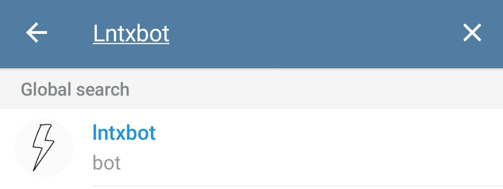
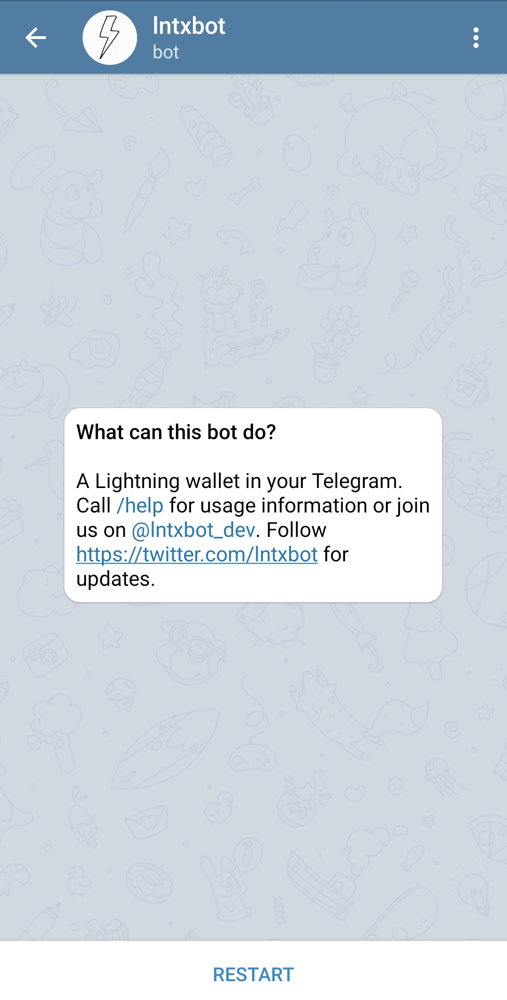
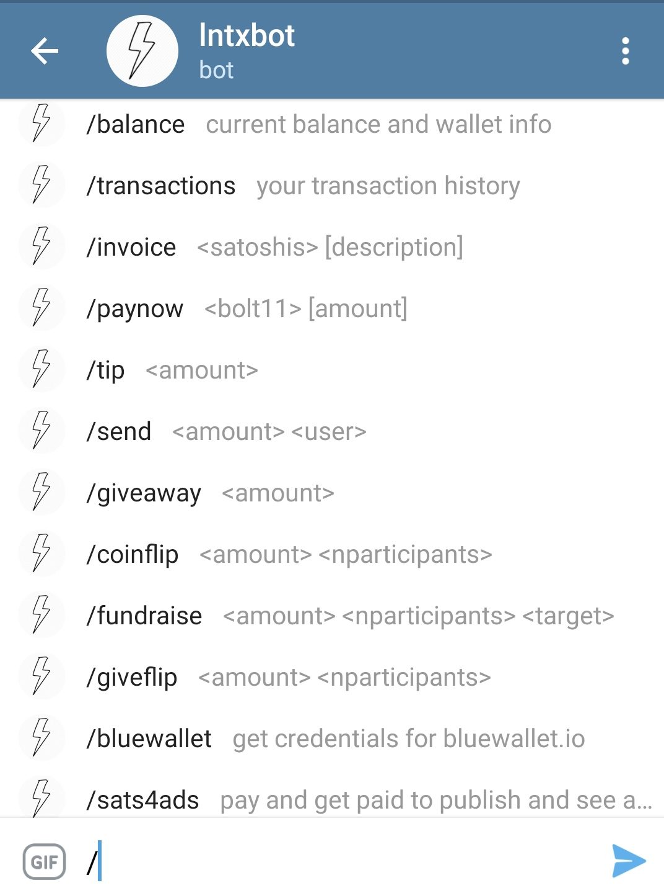

# Lntxbot

## A word of caution


The Lightning Wallet is a "Custodial Bitcoin Wallet". This means, you are trusting those who run the software behind this wallet with satoshis. Be careful and don't keep too many Satoshis on there.


## Updating your current installation

Before you continue, make sure you are on the latest version of the ATM software. For this we go into the `LightningATM` folder and execute one git command:

```text
cd ~/LightningATM
git pull
```

You should now hace the latest changes and therefore the laste version of the LightningATM software on your Raspberry Pi.

## Installing Lntxbot

Install the mobile application "Telegram" on your phone and after you have created your account, go into the search bar and type `Lntxbot`



You should now be able to talk to the Lntxbot. If you type `/help` you will get a list of commands that are available.



You can inspect all the different commands that are available for you on this mobile Lightning Wallet.



## Funding the Lntxbot

In order for this Lightning Wallet to work with our ATM, we need to fund it and have some satoshis on there. Type `/invoice <amount>` into the message box and replace `<amount>` by a certain amount of Satoshis you want to fund it with.

Now, you will have to pay this invoice with another wallet in order for your Lntxbot to receive them and later be available at your ATM.

After you payed this invoice check your balance with `/balance` to make sure it all worked out.

## Connecting the Lntxbot to the ATM

We will now connect the Lntxbot to your ATM. For this we access our ATM again through SSH, change into the `LightningATM` directory and start the software with:

It's best to monitor the log file with `tmux`, while you are doing this. Check out how to do that here:




```text
cd ~/LightningATM
./app.py
```

This will again start the ATM software and we get to see `Welcome to the LightningATM` on our screen.

Next, we will generate a QR code with our Lntxbot credentials. Go to the message box in Lntxbot and type `/lightningatm`. This will generate a QR code with the credentials that we need.

We'll now have to put our ATM into the "credentials scanning" mode. This can be done by pushing the button 3 times.

After you pushed the button three times your display should say `Please scan your wallet credentials`. Now take your mobile phone with the Lntxbot and show the previously generated QR code with your credentials to the camera.

It will now scan your credentials and safe it to the configuration file of the ATM. If you've been successful, your screen will say `Success!!` and show you the current balance of your Lntxbot.

## First transaction with the ATM

Let's make a first proper transaction now!

Insert some coins into the coin acceptor of the ATM and see how the balance increases on the display \(give the ATM some time between coins for coin recognition\).

When you've inserted enough, press the button once \(your balance on the Lntxbot needs to be big enough to cover the requested satoshis\).

The ATM will now create a QR code and display it on the screen with a note that says `Scan to receive`. Take your mobile Lightning Wallet and scan this QR code to receive the satoshis.
