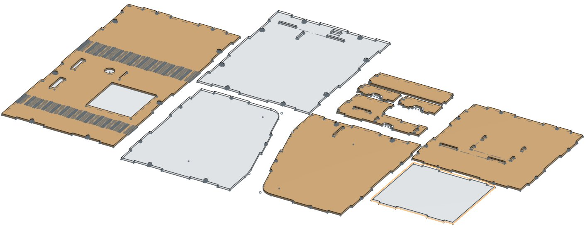

# Hardware requirements

## 🛒 What you will need ...

1. [**Raspberry Pi Zero WH**](hardware-requirements.md#1-raspberry-pi-zero-wh-http-bit-ly-2-maxbr6)
2. [**16 GB SD Card**](hardware-requirements.md#2-16-gb-micro-sd-card-http-bit-ly-39-anm-4-f)
3. [**PaPiRus Zero - ePaper / eInk Screen**](hardware-requirements.md#3-papirus-zero-epaper-eink-screen-http-bit-ly-2-kdsovh)
4. [**Raspberry Pi Zero Camera \(5MP\)**](hardware-requirements.md#4-raspberry-pi-zero-camera-5-mp-http-bit-ly-2-kupvt1)
5. [**Coin Acceptor 616**](hardware-requirements.md#5-coin-acceptor-616-http-bit-ly-2-lhfowk)
6. [**Button**](hardware-requirements.md#6-button-http-bit-ly-2-lk-4-aqr)
7. [**Jumper Cables**](hardware-requirements.md#7-jumper-cables-http-bit-ly-2-kfgns4)
8. [**USB Cable**](hardware-requirements.md#8-usb-cable)
9. [**Power supply \(Option 1 or 2\)**](hardware-requirements.md#9-power-supply)
10. [**Blue tack and double-sided tape or glue**](hardware-requirements.md#10-blue-tack-and-double-sided-tape-or-glue)
11. [**Case for the ATM**](hardware-requirements.md#11-case-for-the-atm)

Price hardware: $50-$70 (only hardware)
Price case: as little as $30 (depending on your supplier)

### 1. Raspberry Pi Zero WH - [http://bit.ly/2maXBr6](http://bit.ly/2maXBr6)

If you can, get the version WH \(not just W\). It comes with pre-soldered headers and can be used out of the box. You should technically also be able to make this work on other versions of the Raspberry Pi but I haven't tried it.

### 2. 16 GB Micro SD Card - [http://bit.ly/39anM4f](http://bit.ly/39anM4f)

8 GB Micro SD card will also work. Just pick any brand with a reasonably good rating. Make sure you've got an adapter to insert your SD card into a computer.

### 3. PaPiRus Zero - ePaper / eInk Screen - [http://bit.ly/2kdSOVh](http://bit.ly/2kdSOVh)

This is the 2 inch ePaper display that I'm using in my build - it's designed for the RPi Zero and comes with a PHAT. My Python scripts are built to talk to the manufacturers library. Future version of the software will support other brands as well for example from the brand waveshare.

### 4. Raspberry Pi Zero Camera \(5MP\) - [http://bit.ly/2kuPvt1](http://bit.ly/2kuPvt1)

Make sure you buy a camera which also comes with the narrower ribbon cable \(Pi Zero Ribbon Cable\). The RPi Zero has a different CSI camera connector than the other versions. The "Pi Zero Ribbon Cable" can also be bought separately.

### 5. Coin Acceptor 616 - [http://bit.ly/2lHfoWK](http://bit.ly/2lHfoWK)

This coin acceptor can accept up to 6 different coins. It can learn what coins you want to use it with. The setup process happens manually on the acceptor itself.

### 6. Button - [http://bit.ly/2lK4AqR](http://bit.ly/2lK4AqR)

Any button that can close a power circuit will do the trick. Don't use a switch that stays permanently in its new position - a click button that is only closed while pressing it. If you are planning to use my laser cut design for the case, make sure the diameter of the thread is just about shy of 16mm.

### 7. Jumper Cables - [http://bit.ly/2kfGns4](http://bit.ly/2kfGns4)

You will need a bunch of jumper cables to connect all the components with each other. Make sure you've got some variety \(male and female\) as you will need to connect different types of pins with each other.

### 8. USB Cable

You need at least one USB cable to power the RPi Zero \(if you choose "Option 1" in point 9 you need another one for the coin acceptor\).

### 9. Power supply

1. Option 1 \(recommended\): Buy a 5V power supply and a small transformer to step up 5V to 12V \(this is the one I use [http://bit.ly/36UypXy](http://bit.ly/36UypXy)\). This option will allow you to run the whole ATM completely on 5V power. Make sure your power supply or power bank can supply 2 amps.
2. Option 2: Buy a 5V and a 12V power supply. 5V for the RPi Zero \(simple USB adapter\) and 12V for the coin acceptor.

### 10. Blue tack and double-sided tape or glue

Choose the right adhesive for your setup depending on how permanent you want to assemble it. I travel with my ATM often so I work mainly with Blue tack - anything that "sticks things to other things" will work.

### 11. Case for the ATM

If you are planning to laser cut my current design of the ATM, you can find the dxf files for your laser cutter here: [Laser cut template on GitHub](https://github.com/21isenough/LightningATM/tree/master/resources/3dmodels) However, the hardware setup is quite flexible so that you can mount it into any box that you see fit.

## 📒 Further Details

* The LightningATM talks over Wifi Internet to API endpoints in order to facilitate the payout of bitcoin to the end-users lightning wallet. Make sure there's Wifi available and you know the Wifis name \(SSID\) and the password.
* Luster terminals make your life easier when connecting cables and can prevent soldering.
* A soldering iron and solder are handy and some connections might be better soldered then clamped/wrapped/screwed. This again depends on how permanent you want it to be.
* Make sure you have different screw drivers and knifes available
* For my laser cut case, I bought small little plastic knobs that I attached to the bottom of the case as feet.
* For my laser cut design you would also need M2.5x10mm screws to assemble the pieces [http://bit.ly/382jufj](http://bit.ly/382jufj)
