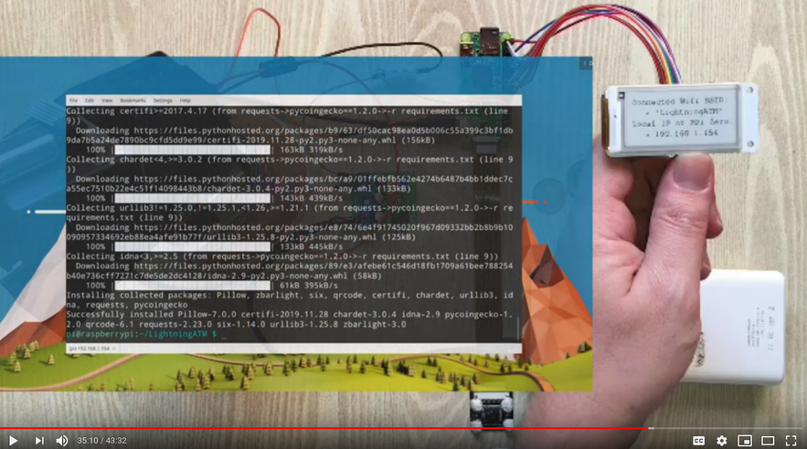

# Software requirements

## 🔨 What you will need ...

There's not much you really need to prepare for. The major part of the software requirements comes directly with the code from the GitHub repository.

**Don't be frightened if you've never done this before. It's all thoroughly explained in the videos. Anyone can do it** 🤩 **!**

* Linux / Mac / Windows - all fine
* Software to flash an SD card \(e.g. [Balena Etcher](https://www.balena.io/etcher/)\)
* SSH client \(e.g. [Putty](https://putty.org/) or your standard command line\)

* Everything else will be directly installed onto the Raspberry Pi during the installation of the ATM. Just follow along with the videos, it's quite straightforward. 
  * Visit [https://github.com/21isenough/LightningATM](https://github.com/21isenough/LightningATM) 

