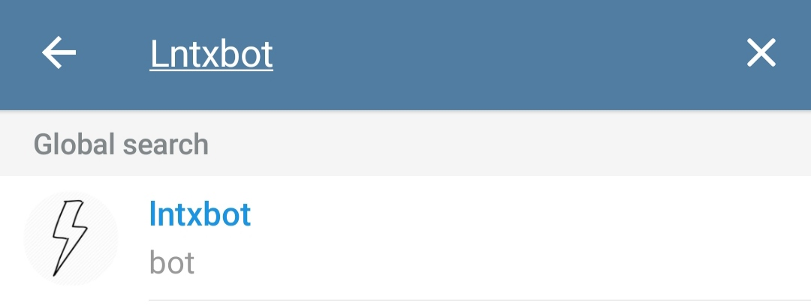

# Lntxbot

## A word of caution


The Lightning Wallet is a "Custodial Bitcoin Wallet". This means, you are trusting those who run the software behind this wallet with Satoshis. Be careful and don't keep too many Satoshis on there.


## Updating your current installation

Before you continue, make sure you are on the latest version of the ATM software. For this we go into the `LightningATM` folder and execute one git command:

```text
cd ~/LightningATM
git pull
```

You should now hace the latest changes and therefore the laste version of the LightningATM software on your Raspberry Pi.

## Installing Lntxbot

Install the mobile application "Telegram" on your phone and after you have created your account, go into the search bar and type `Lntxbot`




