# What will it look like?

Well, the LightningATM can take many shapes or forms. It's really up to you how yours will look like. This is how mine looks - newer and older version 😎 

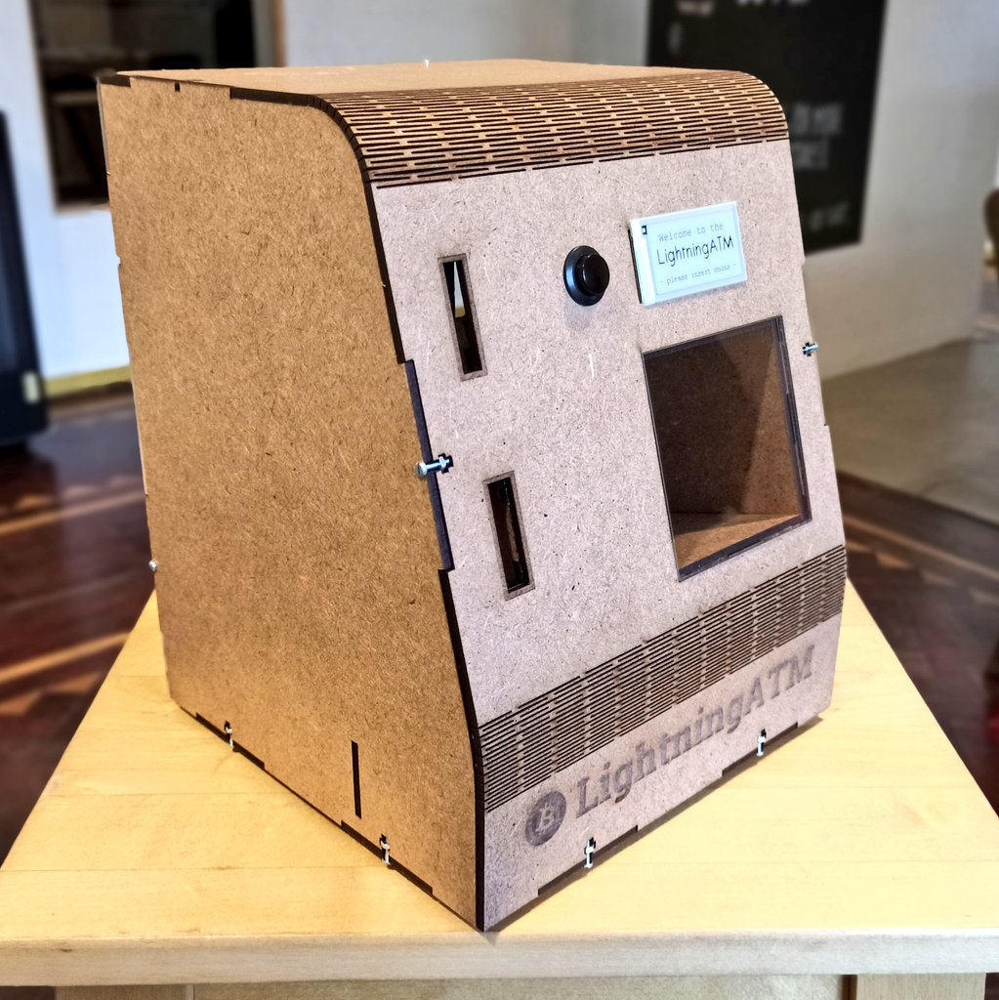

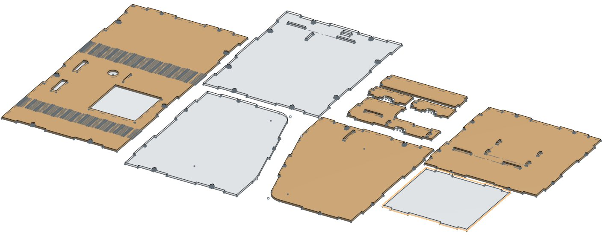

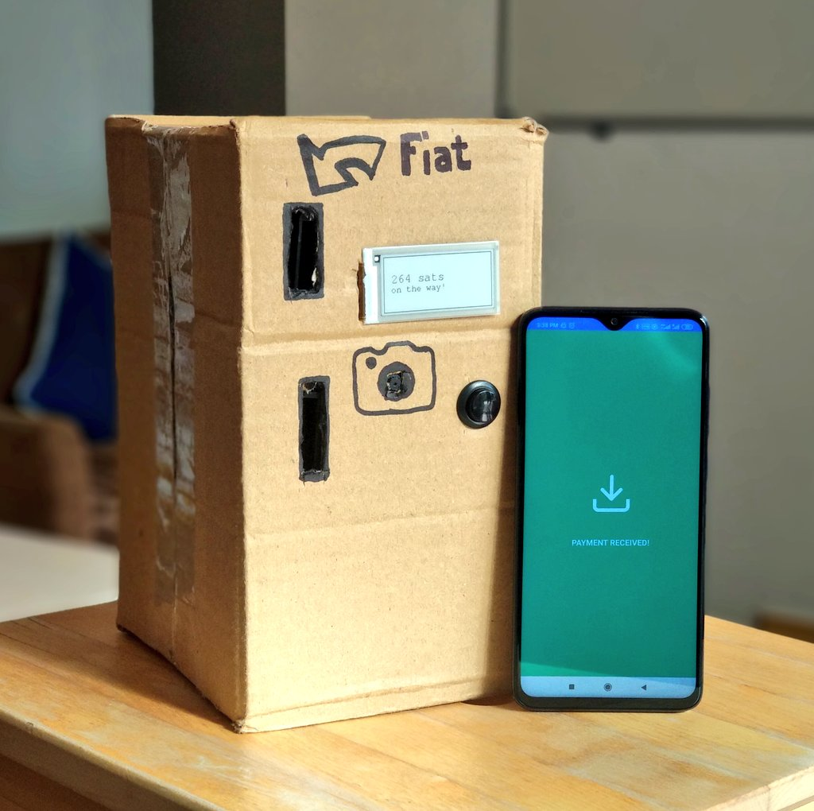

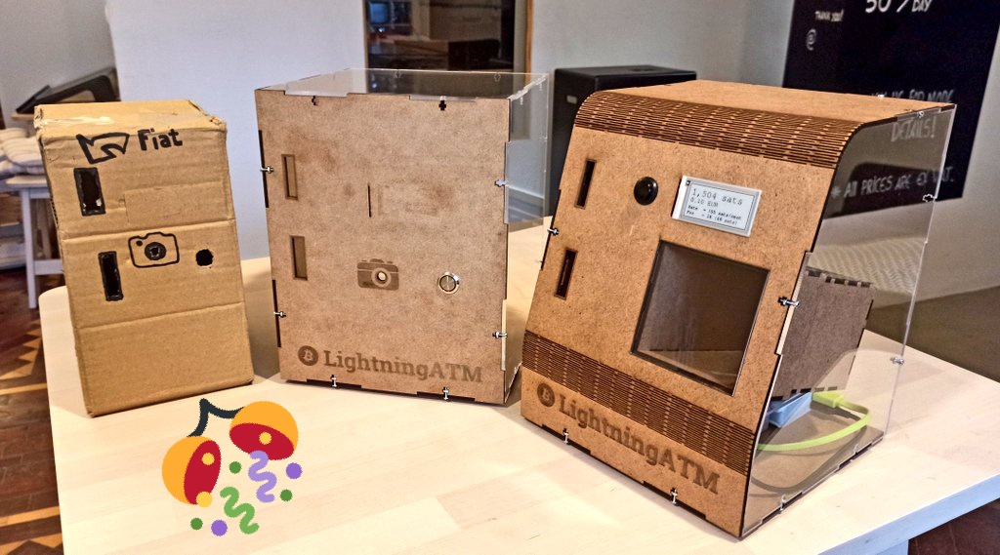

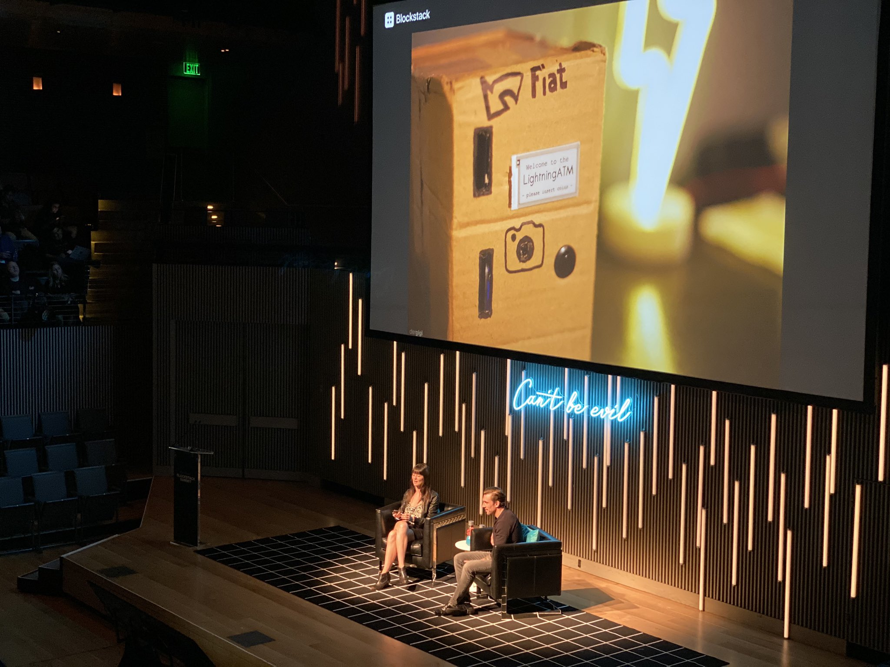

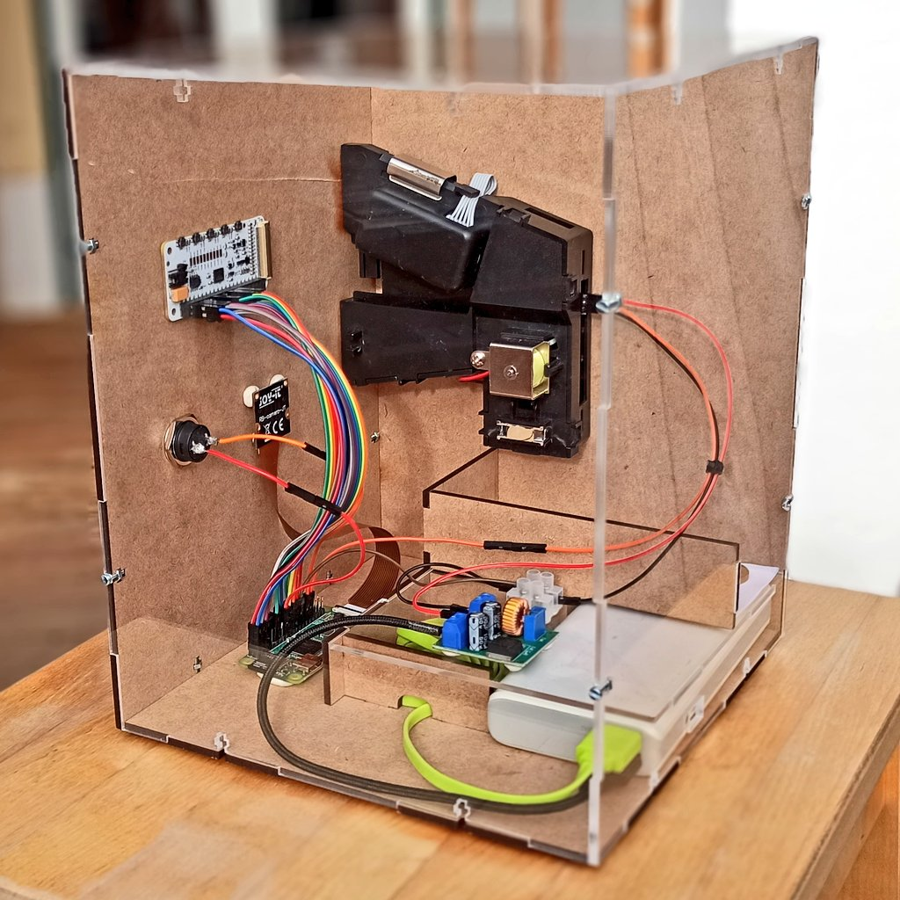

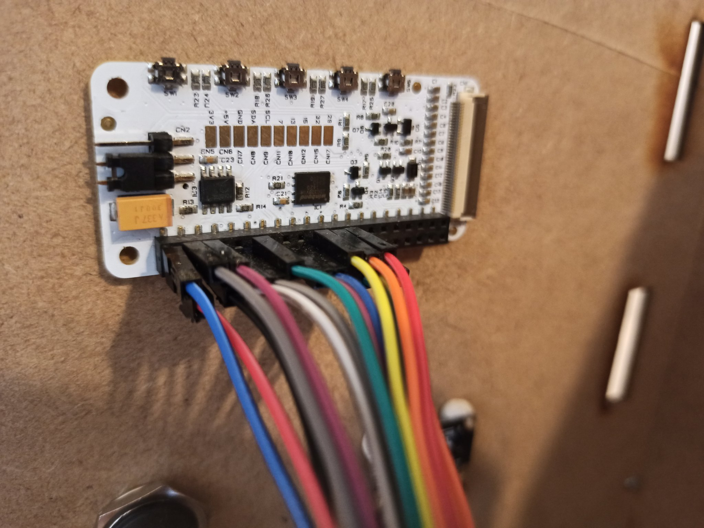

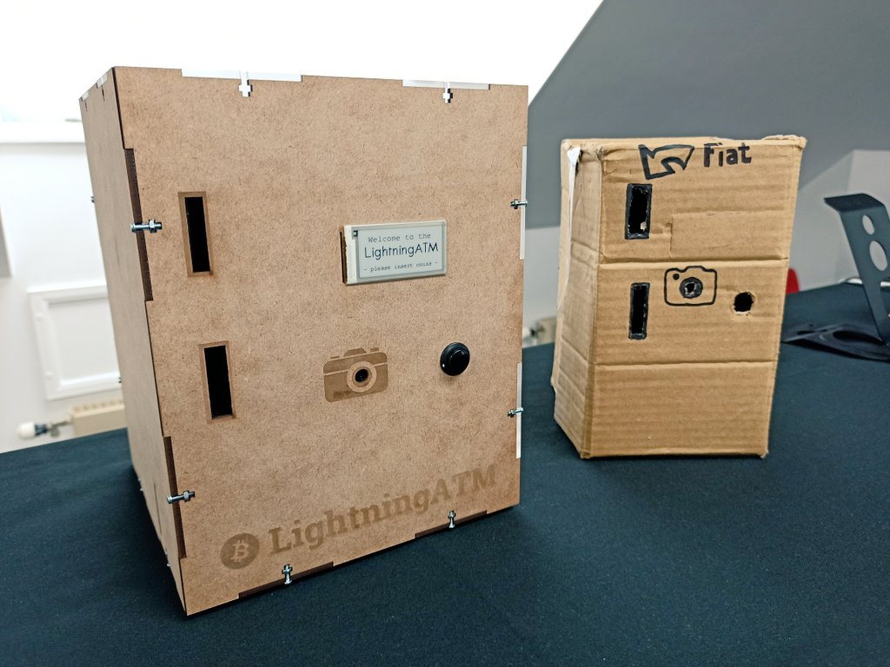

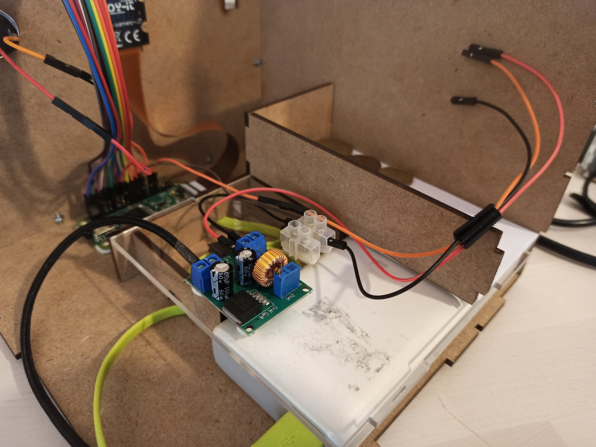

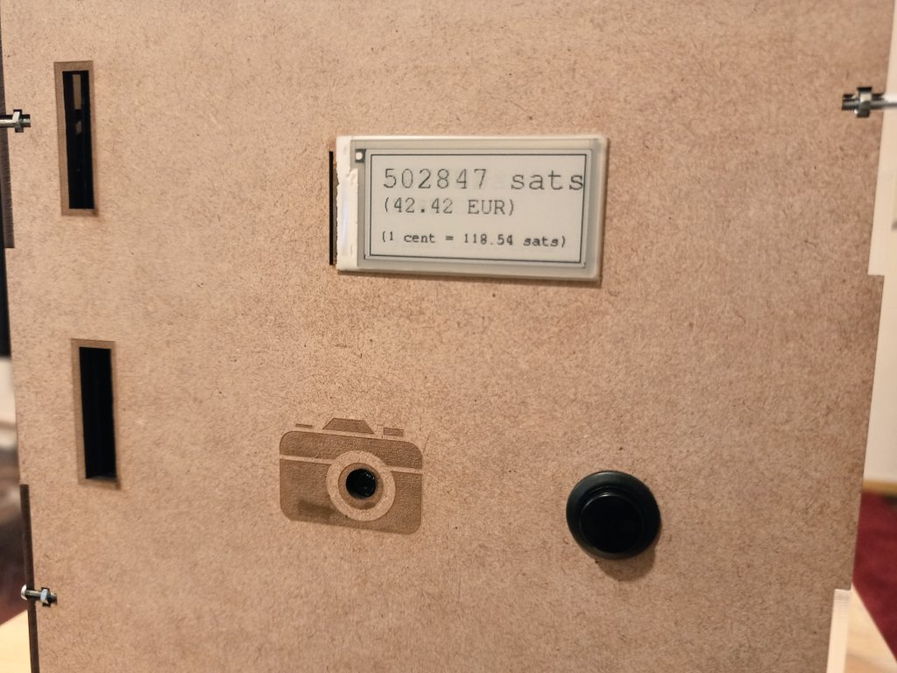

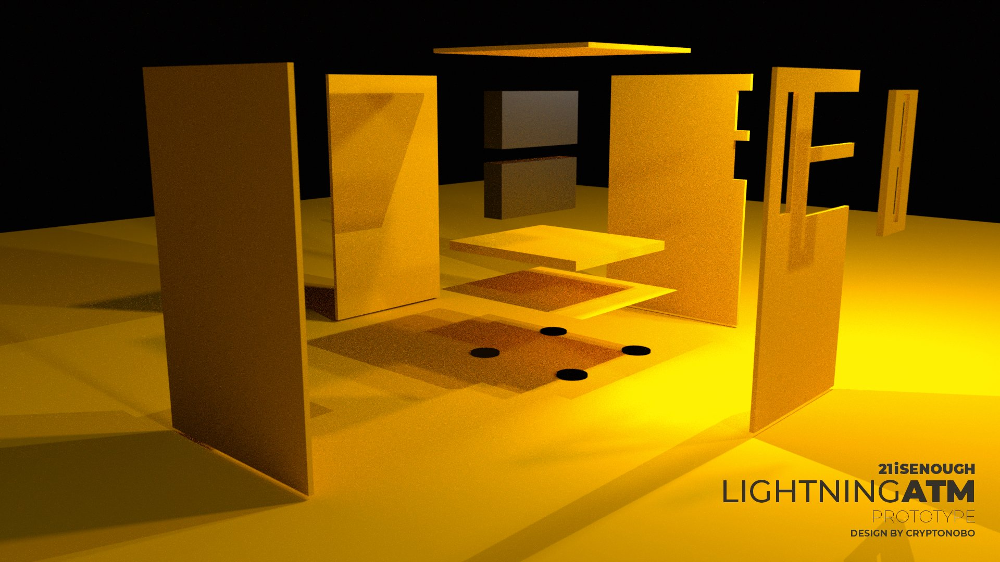

